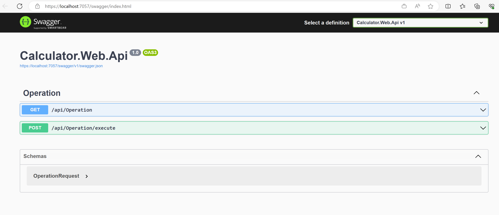
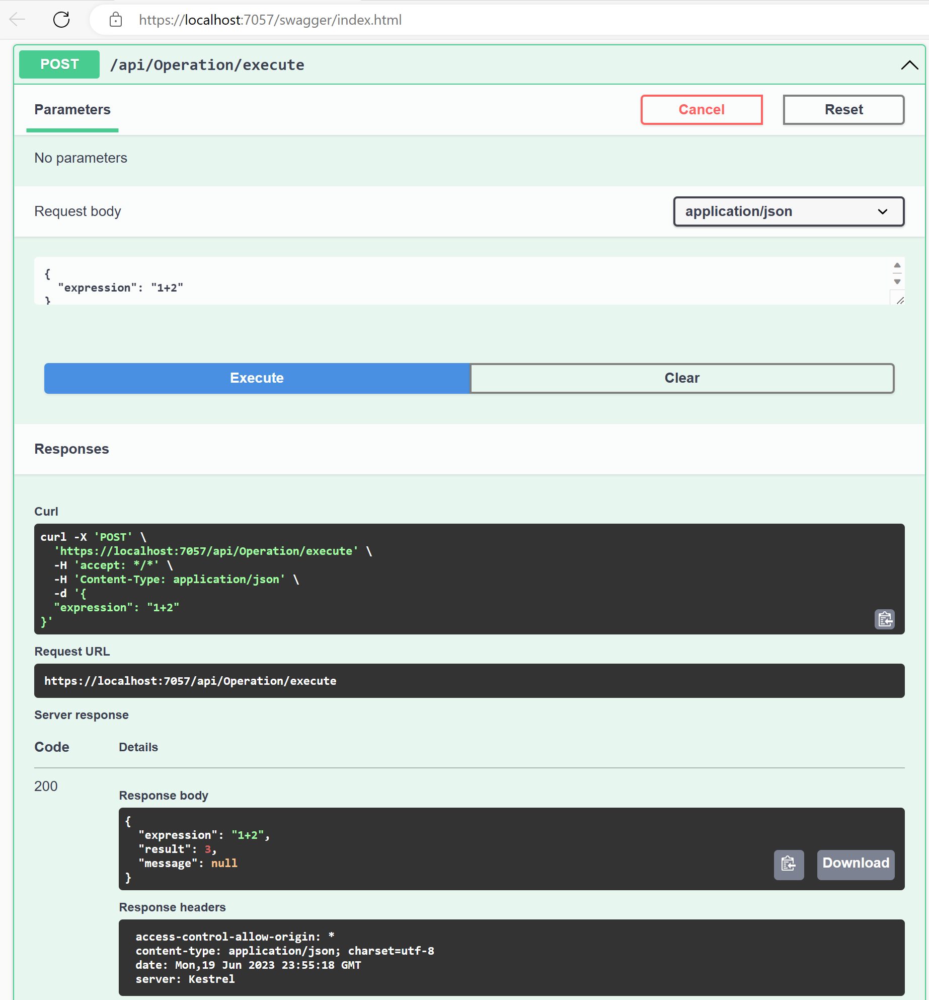
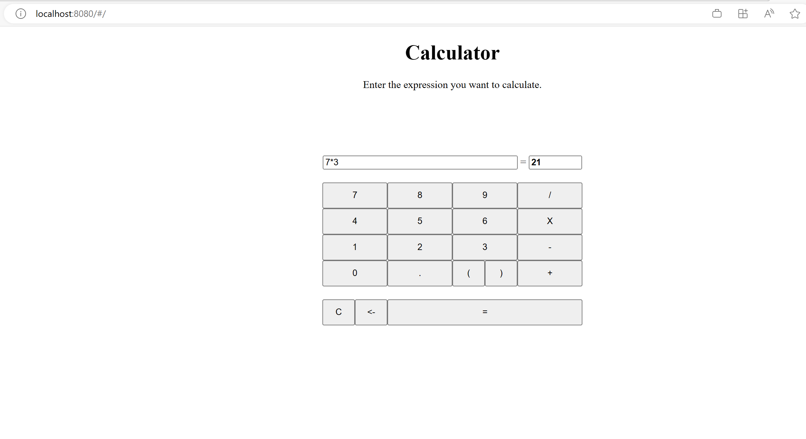
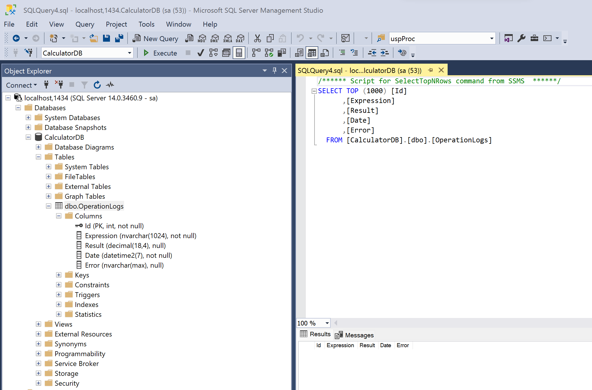

# Calculator application
Sample DevOps app - calculator application with Sql DB, .NET Web Api, and Vue UI


### Execute locally

Pre-requisites:
- SQL Server
- .NET 6.0
- VUE CLI


**Task - Install Calculator DB**

Navigate to *db\Calculator* folder

``` PS
cd .\db\Calculator\
```

Find *MSBuild.exe*

``` PS
$r1 = cmd /c "WHERE /R ""C:\Program Files"" MSBuild.exe"
if(0 -eq $r1.Length) {
    Write-Host "MSBuild.exe cannot be found."
    # exit
}
$msbuild = $r1[0]
# C:\Program Files\Microsoft Visual Studio\2022\Enterprise\MSBuild\Current\Bin\MSBuild.exe
```

Find *SqlPackage.exe*

``` PS
$r2 = cmd /c "WHERE /R ""C:\Program Files"" SqlPackage.exe"
if(0 -eq $r2.Length) {
    Write-Host "SqlPackage.exe cannot be found."
    # exit
}
$sqlpackage = $r2[0]
# C:\Program Files\Microsoft SQL Server\160\DAC\bin\SqlPackage.exe
```

Build DB

``` PS
$cmd = """$msbuild"" ""Calculator.sqlproj"" /t:Build /p:Configuration=Release /p:Platform=""Any CPU"""
cmd /c $cmd
```

Publish DACPAC

``` PS
$dacpac = ".\bin\Release\Calculator.dacpac"
$destSvrName = '.'
$destDbName = 'Calculator'
$destConnection = "Server=$destSvrName;Initial Catalog=$destDbName;Integrated Security=SSPI;"
$cmd = """$sqlpackage"" /a:Publish /sf:""$dacpac"" /tcs:""$destConnection"""
cmd /c $cmd
```

**Task - Build & Run Web Api**

Navigate to *api* folder and open *Calculator.Web.Api.sln* in VS 2022.

Ensure the connection string point sto your local DB:

``` json
  "ConnectionStrings": {
    "Default": "Data source=.;Initial Catalog=Calculator;Integrated Security=SSPI;"
  },
```

Run the Web Api project and ensure the browser is opening on `https://localhost:7057` (optionally Swagger UI is available):



Optionally, test the `Execute` endpoint:



**Task - Run Calculator UI**

Navigate to *ui*

Install dependencies

``` PS
npm install
```

Ensure the API endpoint in *public/assets/config/config.dev.json* file is configured properly

``` json
{
    "apiBaseUrl": "https://localhost:7057/api",
...
}
```

Run the app

``` PS
npm run serve
``` 

Open a browser window and navigate to `http://localhost:8080`




## Execute locally using containers

This approach uses docker compose to run the API and UI services.

The database is running as a container within the same network as the other services.

Pre-requisites
- Docker Desktop

**Task - Build DB container**

Navigate to *db/sqlserver-container* folder.

Build container image

``` PS
$tag = '2017-latest' # '2022-latest'
# docker rm $(docker ps -aq) -f # force remove existing containers
# cat Dockerfile # display Dockerfile content
docker build -t calculator-sqlserver:$($tag) --build-arg tag=$tag .
```

Create network and inspect

``` PS
docker network create calc-net
docker inspect calc-net
```

Run the container instance in detached mode

``` PS
$dbPassword = 'AAAbbb12345!@#$%'
docker run -e ACCEPT_EULA=Y -e MSSQL_SA_PASSWORD=$dbPassword -d -p 1434:1433 --name calc-db --network calc-net calculator-sqlserver:$($tag)
```

Check logs

``` PS
docker logs calc-db -f
```

Connect using docker

``` PS
docker exec -it calc-db /opt/mssql-tools/bin/sqlcmd -S localhost -U sa -P $dbPassword
```

``` SQL
SELECT name FROM master.dbo.sysdatabases
GO
USE CalculatorDB
SELECT * FROM OperationLogs
GO
exit
```

Connect using SSMS, `tcp:localhost,1434`



Running with docker compose

``` PS
docker compose up
```

``` ps
docker compose down
```

**Task - Run Web Api container**

Navigate to *api* folder

Build Web Api container image

``` PS
$tag='0.0.1-local'
docker build -t calculator-api:$($tag) --build-arg USE_ENV_VAR=true --build-arg CALL_TYPE=Direct -f .\Calculator.Web.Api\Dockerfile .
```

Inspect `calc-net` network and capture `calc-db` IP address

``` PS
docker network inspect calc-net
```

Set connection string as environment variable. We will use this env var to pass it it to the running container.
``` PS
$dbPassword = 'AAAbbb12345!@#$%'
# docker container
$IP = '<IP>' # get the IP address rom calc-db container, using docker network inspect calc-net
$connectionString = "Data source=localhost,1434;Initial Catalog=CalculatorDB;User ID=sa;Password='$($dbPassword)'"
$env:CALC_DB_CONNECTIONSTRING = $connectionString
```

Run the Web Api container

``` PS
docker run --name calc-api -p 8080:80 -d -e "CALC_DB_CONNECTIONSTRING=$($env:CALC_DB_CONNECTIONSTRING)" --network calc-net calculator-api:$($tag)
```

Check logs

``` PS
docker logs calc-api -f
```

Test Web Api

``` PS
$expression = "1+2"
$baseUrl = 'http://localhost:8080' # container
$url = "$($baseUrl)/api/Operation/execute"
$data = @{ expression = $expression }
$contentType = 'application/json'
$method = 'POST'
$body = $data | ConvertTo-Json
$result = Invoke-WebRequest -Uri $url -Body $body -Method $method -ContentType $contentType
$result

```

**Task - Run UI**

Navigate to *ui* folder

Build container image

``` PS
$tag = '0.0.1-local'
docker build -t calculator-ui:$($tag) .
```

Run UI container

Ensure the `apiBaseUrl` ise set to the correct Web Api Url (`http://localhost:8080/api`)

``` json
{
    "apiBaseUrl": "http://localhost:8080/api",
...
}


```

``` PS
docker run -d -p 8081:80 --name calc-ui calculator-ui:$($tag)
```

Open a browser window and go to `http://localhost:8081`

**Task - Alternativaley, use docker docker compose**

Remove the previous containers, if running

```PS
docker rm calc-api -f
docker rm calc-ui -f
```

Capture the calc-db container IP address

``` PS
docker network inspect calc-net
```

You should see something like below:

``` json
...
        "Containers": {
            "2ecf312e6fa7aa58302ee06830beb687af52ab9968225ce4ce433639993427fd": {
                "Name": "calc-db",
                "EndpointID": "f5563479e48ae8e2cfe6519f4134872544fea60c0d4ed603161ebe20935fb1f0",
                "MacAddress": "02:42:ac:19:00:02",
                "IPv4Address": "172.25.0.2/16",
                "IPv6Address": ""
            }
        },
...
```

Navigate to *api* folder.
Check *docker-compose.yml* file and inspect the `calc-api` and `calc-ui` services.
Update `<IP>` value in the `CALC_DB_CONNECTIONSTRING` env var with the value captured earlier. 

``` yaml
version: '3.4'

services:
  calc-api:
    image: ${DOCKER_REGISTRY-}calculator-api:0.0.1-local
    container_name: calc-api
    #build:
    #  context: .
    #  dockerfile: Calculator.Web.Api/Dockerfile
    ports:
    - "8080:80"
    environment:
    - CALC_DB_CONNECTIONSTRING=Data Source=<IP>;Initial Catalog=CalculatorDB;User ID=sa;Password=AAAbbb12345!@#$%
    networks:
    - calc-net
  calc-ui:
    image: ${DOCKER_REGISTRY-}calculator-ui:0.0.1-local
    container_name: calc-ui
    #build:
    #  context: .
    #  dockerfile: ../ui/Dockerfile
    ports:
    - "8081:80"
    networks:
    - calc-net

networks:
  calc-net:
    driver: bridge
    name: calc-net
```

Spin up services

``` PS
docker compose up
```

Navigate to `http://localhost:8081`, perform some calculations and check the DB.

Tear down services

``` PS
docker compose down
```

## Execute in K8S

